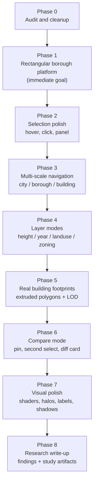
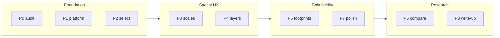

# Levitating City Twin - Phased Roadmap

A research / prototype plan for turning [src/components/three/levitating-scene.js](src/components/three/levitating-scene.js) and [src/components/three/spatial-building-layer.js](src/components/three/spatial-building-layer.js) from a square-plinth box layer into a multi-scale spatial digital twin.

## Phase map

---

## Phase 0 - Audit and cleanup (~0.5 day)

Pin down what we are actually shipping on this branch and prune dead imports.

- Decide which of the carry-over files we want to keep: [building-layer.js](src/components/three/building-layer.js), [city-scene3d.js](src/components/three/city-scene3d.js), [city-scene-mapbox.js](src/components/three/city-scene-mapbox.js), [active-filters-3d.js](src/components/three/active-filters-3d.js), [legend-3d.js](src/components/three/legend-3d.js). They are unused on the spatial branch but useful as references.
- `SpatialTwinView` accepts `onApplyFilters`, `activeFilters`, `clearAll` from a previous filter API but never uses them - remove or wire up. See [spatial-twin-view.js](src/components/layout/spatial-twin-view.js).
- Confirm the data file (`public/pluto_3d_sample.csv`) and field names. `App.js` casts numerics but does not validate `borough` codes; log unique values once, then drop the console log.

## Phase 1 - One borough across a rectangular platform (immediate goal)

Goal: Manhattan reads as Manhattan-shaped on a properly-proportioned plinth.

Files to change: [levitating-scene.js](src/components/three/levitating-scene.js), [spatial-building-layer.js](src/components/three/spatial-building-layer.js).

- Compute borough geo extent once with `getGeoExtent(data)` from [src/utils/projection.js](src/utils/projection.js).
- Derive aspect-correct `platformWidth` and `platformDepth` using `cos(centerLat)` so Manhattan ends up roughly 0.4 wide by 1.0 deep (the borough's real ratio) inside a target world size like 12.
- Replace `BasePlatform`'s hard-coded `[14, 0.18, 14]` with `[platformWidth + margin, 0.18, platformDepth + margin]`. Same for the top surface, glow, and `gridHelper`. Pass dimensions down from `LevitatingCityScene` as props.
- In `SpatialBuildingLayer`, replace the local `computeLocalBounds` + `normalizeToPlatform` with a shared projector from `utils/projection.js` so longitude is no longer stretched to fit a square. Drop `platformSize: 10.8` and accept `{ platformWidth, platformDepth }` instead.
- Add a small inset margin so buildings near the borough edge don't hang off the plinth.

Acceptance: Manhattan looks like Manhattan, not a square blob; no buildings clip the platform edge.

## Phase 2 - Selection polish (~1 day)

Make a building feel like a thing you can grab, not a generic raycast hit.

- Add a hover tooltip using [building-tooltip.js](src/components/three/building-tooltip.js) (already drei-based) anchored to the top of the hovered instance.
- Replace the raw selection card in [spatial-twin-view.js](src/components/layout/spatial-twin-view.js) with the richer [selection-panel.js](src/components/three/selection-panel.js), restyled for the dark levitating aesthetic.
- Selection visual: draw a thin emissive outline + a translucent ground halo at the selected building's base. Pattern already used in [building-layer.js](src/components/three/building-layer.js), port the `SelectionLayer` group.
- Click on empty platform should clear selection.

## Phase 3 - Multi-scale navigation (~1-2 days)

Right now the city / borough / building tabs only resize the model. Make them actually change camera framing.

- Adopt [camera-rig.js](src/components/three/camera-rig.js) (lerp to preset) instead of bare `OrbitControls` in `LevitatingCityScene`.
- Define three preset framings in `levitating-scene.js`:
  - `city`: full plinth in view, high pitch.
  - `borough`: tighter framing on the borough centroid.
  - `building`: orbit around `selectedRecord`'s world position, low pitch.
- When a building is clicked while in `building` mode, fly the rig target to that building's world XZ.
- Add a small breadcrumb above the canvas: `City > Manhattan > {address}`.

## Phase 4 - Layer modes (~1-2 days)

Switch what the buildings *mean*, not just what they look like.

- Add a `layerMode` state in `SpatialTwinView`: `default` (single accent), `height`, `yearBuilt`, `landUse`, `zoning`.
- In `SpatialBuildingLayer`, build the per-instance color from `layerMode` using helpers in [src/utils/building-color.js](src/utils/building-color.js): `createMetricColorScaleFromData` for height / year, categorical map for land use / zoning.
- Add a layer toggle (chip group) next to the scale tabs, plus a small floating legend on the platform corner using [legend-3d.js](src/components/three/legend-3d.js) as reference.
- Keep the selection / hover color override on top of the layer color.

## Phase 5 - Real building footprints (~2-3 days)

Replace the unit-cube extrusions with extruded polygons from NYC Open Data.

- Use [src/utils/footprints.js](src/utils/footprints.js) (`fetchFootprintsForRecords`) to resolve footprints lazily for the current borough; respect its session cache so reload is cheap.
- Port [footprint-building-layer.js](src/components/three/footprint-building-layer.js) and [footprint-mesh.js](src/components/three/footprint-mesh.js) into a new `LevitatingFootprintLayer` that projects polygons through the same shared projector as Phase 1.
- LOD swap: use the box `InstancedMesh` from Phase 1 below a zoom / distance threshold; swap to extruded polygons when the camera is closer than ~`12` world units to the platform centroid.
- Fallback: any record without a matched footprint stays on the box renderer so the scene never has gaps.

## Phase 6 - Compare mode (~1 day)

The first explicitly research-flavored interaction.

- Add a "Pin" action on the existing selection card (button already drawn, just stub today). Pinned record persists in state.
- After a pin, the next click selects a *second* building. A side-by-side compare card appears showing both records' floors / year / area / land use, with delta values.
- Visual: pinned building gets a steady cyan halo; comparison building gets a magenta halo.
- Clearing either pin returns to single-select mode.

## Phase 7 - Visual polish (~1-2 days)

- Floor-band shader on selected / focused buildings (pattern in [city-scene-mapbox.js](src/components/three/city-scene-mapbox.js), constants `FLOOR_BAND_*`).
- Soft fake ground shadows under buildings (precomputed mesh, slightly inflated footprint).
- Borough label floating just above the platform using `Text` from drei (start from existing `SceneLabels`).
- Subtle ambient-occlusion-style darkening between dense buildings - cheap fragment shader on the ground.

## Phase 8 - Research write-up

Capture findings while building so the project reads as research, not just a demo. Suggested artifacts in `docs/`:

- `docs/research-notes.md` - hypotheses, what each phase tested, what we learned about spatial selection, scale transitions, layer legibility.
- Short screen-recording for each phase so the progression is documented.
- Optional small user study: 3-5 testers, tasks like "find the tallest building built before 1950 in Manhattan".

---

## Reference files

- Scene root: [src/components/three/levitating-scene.js](src/components/three/levitating-scene.js)
- Building layer: [src/components/three/spatial-building-layer.js](src/components/three/spatial-building-layer.js)
- Shell + scale tabs: [src/components/layout/spatial-twin-view.js](src/components/layout/spatial-twin-view.js)
- Projection utilities: [src/utils/projection.js](src/utils/projection.js)
- Color utilities: [src/utils/building-color.js](src/utils/building-color.js)
- Footprint fetcher: [src/utils/footprints.js](src/utils/footprints.js)
- Color tokens: [src/colors.js](src/colors.js)

## On generating an image of the plan

Image generation writes a binary file, which is a non-readonly action. The diagrams above render in the plan view. If you also want a polished PNG (poster-style roadmap visual), confirm and I will switch to agent mode just for that step.
