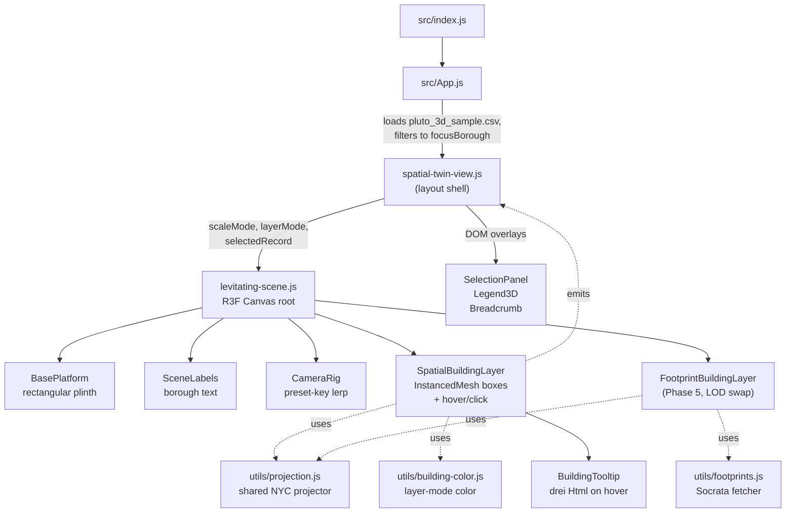

# Levitating City Twin — Focused Build Plan

> Scope lock: this project is now **only** the Levitating City Twin spatial prototype. Everything else (the 2D dashboard, charts, dot map, filter bars, multi-borough overview) is deleted. We rebuild a single, tight system from the parts that are still useful.

---

## 1. Project mission (one sentence)

Render **one borough** as a **levitating, rectangular, interactive 3D model** on a floating platform, where users can orbit, hover, and click any building to inspect its metadata — using only React + React Three Fiber + Three.js.

That's the entire deliverable. No charts. No dashboard. No multi-borough overview. No mapbox.

---

## 2. Tech stack (locked)

Keep:

- **React 18** — UI shell.
- **`@react-three/fiber` (R3F)** — declarative wrapper around Three.js. The whole scene lives inside `<Canvas>`.
- **`@react-three/drei`** — `OrbitControls`, `Text`, `Html` (for tooltip / breadcrumb).
- **`three`** — geometry / materials / extrusion / instanced meshes.
- **`d3` (v7)** — only the bits used by [src/utils/building-color.js](src/utils/building-color.js): `d3.scaleSequential`, `d3.quantile`, `d3.interpolateRgbBasis`. Don't expand its use; it stays a tiny color helper.

Drop:

- **`mapbox-gl`** — was only used by the deleted dashboard renderer. Remove from `package.json`.
- **`gh-pages`** — optional. Keep only if you still want `npm run deploy` to a GitHub Pages site for the prototype.

Data:

- One CSV: `public/pluto_3d_sample.csv`. Columns we actually consume: `borough`, `latitude`, `longitude`, `numfloors`, `yearbuilt`, `bldgarea`, `landuse`, `zonedist1`, `address`, `bbl` (used as a stable id).

Build / dev:

- `react-scripts` (CRA) — unchanged. `npm start` / `npm run build`.

---

## 3. What we delete vs. what we keep

### 3.1 Delete (dashboard era — none of this is referenced once we rip out `mapbox-gl`)

Files / folders to remove from the repo:

- `src/components/charts/` (entire folder) — all six dashboard charts:
  - `dotmap.js`, `landusebar.js`, `scatterplot.js`, `summarycards.js`, `trendline.js`, `zoningbar.js`
- `src/components/layout/dashboard.js` — old grid layout.
- `src/components/layout/topbar.js` — dashboard header.
- `src/components/layout/filtersbar.js` — borough chip filter bar.
- `src/components/layout/city-view3d.js` — wrapper that hosted the mapbox scene.
- `src/components/three/city-scene-mapbox.js` — 1,653-line mapbox-gl renderer.
- `src/components/three/city-scene3d.js` — the older R3F multi-borough scene.
- `src/components/three/footprint-mesh.js` — imports `mapbox-gl`, tied to the mapbox renderer; we will write our own much smaller extrusion path in Phase 5.
- `src/components/three/ground-plane.js` — 18-line generic ground plane; the levitating scene has its own platform.
- `src/components/three/active-filters-3d.js` — dashboard filter pills.
- `src/components/three/borough-boundaries.js`, `borough-ground-tints.js`, `borough-labels3d.js` — multi-borough hull / tint / label layers; the prototype only ever shows one borough.
- `src/components/three/camera-presets.js` — per-borough preset row; we will use a simpler scale-mode preset list living inline in `levitating-scene.js`.
- `src/components/three/building-layer.js` — old 5-borough InstancedMesh; superseded by `spatial-building-layer.js`.

Public assets to remove:

- `public/pluto_sample.csv` — old dashboard sample.
- `public/full_stats.csv`, `public/landuse_data.csv`, `public/trend_data.csv`, `public/zoning_data.csv` — pre-aggregated dashboard data.
- `public/borough-geojson.json` — only needed for the multi-borough hulls.

Other:

- `src/utils/borough-hulls.js` — only used by deleted borough boundaries / tints.
- Drop `mapboxgl` import side-effects everywhere; remove from `package.json`.
- `.env` `REACT_APP_MAPBOX_TOKEN` line is no longer needed.

### 3.2 Keep — these become the entire system

Core three / scene:

- [src/components/three/levitating-scene.js](src/components/three/levitating-scene.js) — root R3F canvas, lights, platform, labels, camera. **Modify heavily.**
- [src/components/three/spatial-building-layer.js](src/components/three/spatial-building-layer.js) — instanced building boxes; hover + select. **Modify.**
- [src/components/three/building-tooltip.js](src/components/three/building-tooltip.js) — drei `<Html>` hover tooltip. **Reuse as-is, restyled.**
- [src/components/three/selection-panel.js](src/components/three/selection-panel.js) — building-info panel. **Restyle for the dark theme; keep the data layout.**
- [src/components/three/camera-rig.js](src/components/three/camera-rig.js) — preset-key lerp controller. **Reuse as-is.**
- [src/components/three/legend-3d.js](src/components/three/legend-3d.js) — small floating legend. **Reuse for layer-mode legend in Phase 4.**
- [src/components/three/footprint-building-layer.js](src/components/three/footprint-building-layer.js) — already uses our shared projector. **Reuse as base for Phase 5.**

Layout / shell:

- [src/components/layout/spatial-twin-view.js](src/components/layout/spatial-twin-view.js) — the only layout component left. **Modify to host scale tabs + layer-mode tabs + breadcrumb.**
- [src/components/layout/spatial-twin.css](src/components/layout/spatial-twin.css) — the dark levitating theme. **Modify.**

Utilities:

- [src/utils/projection.js](src/utils/projection.js) — cos-lat-corrected lng/lat → world XZ. **Use everywhere; replace the homegrown normalizer in `spatial-building-layer.js`.**
- [src/utils/building-color.js](src/utils/building-color.js) — borough palette + metric/categorical color scales. **Use in Phase 4.**
- [src/utils/footprints.js](src/utils/footprints.js) — Socrata `5zhs-2jue` fetcher. **Use in Phase 5.**
- [src/colors.js](src/colors.js) — borough palette tokens. **Use as-is.**

App:

- [src/App.js](src/App.js) — loads CSV, filters to focus borough, renders `SpatialTwinView`. **Trim and clean.**
- `src/App.css` — global resets. **Keep, audit for dashboard-only rules.**
- `src/index.js` — CRA entry. **Keep.**

---

## 4. Final component map (after the cleanup)



### 4.1 Who comes in at which phase

- **Phase 1** — `App.js`, `spatial-twin-view.js`, `levitating-scene.js`, `spatial-building-layer.js`, `utils/projection.js`.
- **Phase 2** — adds `building-tooltip.js`, `selection-panel.js`.
- **Phase 3** — adds `camera-rig.js`.
- **Phase 4** — adds `utils/building-color.js`, `legend-3d.js`.
- **Phase 5** — adds `footprint-building-layer.js`, `utils/footprints.js`.

---

## 5. Data flow

```mermaid
sequenceDiagram
    participant CSV as public/pluto_3d_sample.csv
    participant App as App.js
    participant View as spatial-twin-view.js
    participant Scene as levitating-scene.js
    participant Layer as spatial-building-layer.js
    participant Proj as utils/projection.js

    App->>CSV: d3.csv(...)
    CSV-->>App: rows
    App->>App: cast numerics; filter borough == focusBorough
    App->>View: data, focusBorough
    View->>View: hold scaleMode, layerMode, selected, hovered
    View->>Scene: data, scaleMode, layerMode, selected, callbacks
    Scene->>Proj: getGeoExtent(data) → extent
    Scene->>Proj: createProjection(extent, worldSize)
    Scene->>Layer: data, projector, platformWidth, platformDepth, layerMode
    Layer->>Layer: instances[i] = { x, z, height, footprint, color }
    Layer-->>Scene: render InstancedMesh
    Layer-->>View: onHoverChange, onSelect (record)
```

---

## 6. Phases — file-by-file

Each phase says: **what to change**, **which files**, **why**.

### Phase 1 — Rectangular borough platform (the immediate goal)

Outcome: Manhattan reads as Manhattan-shaped on a properly-proportioned plinth, with no longitudinal stretch.

1. **`src/components/three/spatial-building-layer.js`**
   - Remove local `computeLocalBounds` and `normalizeToPlatform`.
   - Accept a `project` function and `{ platformWidth, platformDepth }` props.
   - For each record: `const { x, z } = project(+d.longitude, +d.latitude);` clamp/scale into the platform rectangle (with inset margin) instead of a single `platformSize`.
   - Leave hover / click logic intact; it's already correct.

2. **`src/components/three/levitating-scene.js`**
   - At the top of the component, compute extent + projector from `data`:
     ```javascript
     const extent = useMemo(() => getGeoExtent(data), [data]);
     const project = useMemo(() => createProjection(extent, { worldSize: 12 }), [extent]);
     const { platformWidth, platformDepth } = useMemo(
       () => derivePlatformSize(extent, 12),
       [extent]
     );
     ```
   - `BasePlatform` becomes `BasePlatform({ width, depth })`. All three meshes (plinth, top surface, glow) and the `gridHelper` use those dimensions. Aspect ratio is set by the borough, not hard-coded `[14, 0.18, 14]`.
   - Pass `project, platformWidth, platformDepth` into `<SpatialBuildingLayer>`.
   - Keep `OrbitControls` for now — the rig replacement lands in Phase 3.

3. **`src/utils/projection.js`** — already has everything we need (`getGeoExtent`, `createProjection`). Add one tiny helper next to them:
   ```javascript
   export function derivePlatformSize(extent, worldSize) {
     const cosLat = Math.cos((extent.centerLat * Math.PI) / 180);
     const lngSpan = (extent.maxLng - extent.minLng) * cosLat;
     const latSpan = extent.maxLat - extent.minLat;
     const scale = worldSize / Math.max(lngSpan, latSpan);
     return { platformWidth: lngSpan * scale, platformDepth: latSpan * scale };
   }
   ```

Acceptance: orbit Manhattan, see a tall narrow plinth (~5 × 12 world units), buildings tightly packed, no edge clipping, no horizontal stretch.

### Phase 2 — Selection polish

Outcome: hover shows a tooltip, click shows a richer panel, the selected building visibly stands out in 3D.

1. **`src/components/three/spatial-building-layer.js`**
   - Track the hovered instance's world position in a ref so the parent can render a tooltip at it.
   - Expose an `onHoverPositionChange(vec3 | null)` callback alongside the existing `onHoverChange`.
   - For the selected building, render a small `<group>` sibling: a thin `EdgesGeometry` outline mesh + a flat translucent `ringGeometry` halo at `y = 0.01` centered on the building.

2. **`src/components/three/building-tooltip.js`** — already drei `<Html>`-based. Reuse unchanged but restyle the inner card to match the dark theme (drop the `.d3-tooltip` class, inline the styles).

3. **`src/components/three/selection-panel.js`**
   - Restyle for dark glass: same layout, swap colors to match `.spatial-selection-card` rules in `spatial-twin.css`.
   - Drop the "Apply as Filters" button (no filter system to apply to). Keep "Pin building" as a stub, hidden until Phase 6.

4. **`src/components/layout/spatial-twin-view.js`**
   - Replace the inline selection card with `<SelectionPanel record={selectedRecord} onClear={...} />`.
   - On canvas click that hits empty platform (`onPointerMissed` on `<Canvas>`), call `setSelectedRecord(null)`.

Acceptance: hover any building → small floating card; click any building → panel on the right with all six metrics; the selected box is visibly outlined.

### Phase 3 — Multi-scale navigation

Outcome: the city / borough / building tabs change camera framing instead of XZ scale.

1. **`src/components/three/levitating-scene.js`**
   - Replace `<OrbitControls>` with `<CameraRig presetKey={...} target={...} position={...} />`.
   - Define a `presets` object computed from `extent` and `selectedRecord`'s world position:
     - `city` → high pitch, full plinth in view, target `[0, 0, 0]`.
     - `borough` → medium pitch, target borough centroid (`[0, 0, 0]` already), tighter distance.
     - `building` → low pitch, target the selected building's `(x, height/2, z)`, distance ~3 world units.
   - `presetKey` is `${scaleMode}:${selectedId ?? 'none'}` so flying to a newly selected building re-fires the lerp.

2. **`src/components/three/camera-rig.js`** — reuse unchanged.

3. **`src/components/layout/spatial-twin-view.js`**
   - Add a breadcrumb above the canvas: `Levitating City Twin › {focusBorough} › {selectedRecord?.address ?? '—'}`.
   - Auto-switch `scaleMode` to `building` whenever a record is selected; clearing selection returns to the previous mode.

Acceptance: clicking the tabs visibly flies the camera; selecting a building auto-frames it.

### Phase 4 — Layer modes

Outcome: the buildings can be re-colored to *mean* something — height, year built, land use, zoning.

1. **`src/components/layout/spatial-twin-view.js`**
   - Add `layerMode` state: `'default' | 'height' | 'year' | 'landuse' | 'zoning'`.
   - Render a small toggle row in the toolbar next to the scale tabs.
   - Pass `layerMode` into `<LevitatingCityScene>` → `<SpatialBuildingLayer>`.

2. **`src/components/three/spatial-building-layer.js`**
   - Build a per-instance color array from `layerMode`:
     - `default` → constant accent (current rose).
     - `height` → `createMetricColorScaleFromData(data, 'numfloors')`.
     - `year` → `createMetricColorScaleFromData(data, 'yearbuilt')`.
     - `landuse` → categorical map keyed by `landuse` code.
     - `zoning` → categorical map keyed by `zonedist1` prefix (`R`, `C`, `M`, `PARK`, ...).
   - Selection / hover colors override the layer color (already the case — keep that branch first in the conditional).

3. **`src/components/three/legend-3d.js`** — render as a DOM sibling of `<Canvas>` (top-right). Driven by the active `layerMode`.

Acceptance: switching modes recolors the city instantly; legend updates; selection still highlights cleanly.

### Phase 5 — Real building footprints (LOD swap)

Outcome: zoom in close → see real polygon shapes; zoom out → fall back to fast instanced boxes.

1. **`src/components/three/footprint-building-layer.js`**
   - Already uses the projector. Two changes:
     - Project through the **same** Phase-1 projector (passed in as a prop), not `PROJECTOR_NYC`.
     - Replace the per-feature `<mesh>` loop with a single merged geometry via `mergeGeometries(geoms)` for performance.

2. **`src/components/three/levitating-scene.js`**
   - Track camera distance to origin via `useFrame`; expose a boolean `isCloseUp` (e.g. `< 8` world units).
   - Render `<SpatialBuildingLayer>` always; render `<FootprintBuildingLayer>` only when `isCloseUp`.
   - Trigger `fetchFootprintsForRecords(data)` lazily on first close-up; cache results in scene state.

3. **`src/utils/footprints.js`** — reuse as-is.

Acceptance: orbit out → see boxes (fast); orbit in → see real Manhattan footprints. Records the API can't match silently fall back to boxes.

---

## 7. Concrete file checklist for the first commit (Phase 1)

- [ ] Delete the files in §3.1.
- [ ] Remove `mapbox-gl` from `package.json`; `npm install` to regenerate `package-lock.json`.
- [ ] Remove `REACT_APP_MAPBOX_TOKEN` from `.env`.
- [ ] Trim `src/App.js` (drop dead imports, drop the `console.log` of unique boroughs).
- [ ] Add `derivePlatformSize` to `src/utils/projection.js`.
- [ ] Make `BasePlatform` accept `width` / `depth` in `src/components/three/levitating-scene.js`.
- [ ] Compute extent + projector + platform dims in `LevitatingCityScene` and pass through.
- [ ] Replace local normalization in `src/components/three/spatial-building-layer.js` with the shared projector and rectangular platform.
- [ ] Verify: `npm start`, navigate to the app, see a rectangular Manhattan-proportioned plinth full of accurately placed buildings.

---

## 8. Out of scope (do not build)

To keep the prototype focused on the research question (*how do users explore dense urban data when the city is a manipulable 3D object?*), these are explicitly **not** part of the build:

- 2D charts, dot maps, dashboards.
- Cross-filtering UI; brush selection; filter chips.
- Multi-borough overview; comparisons between boroughs.
- Persistence (saving views, sharing URLs).
- Accessibility for non-pointer input (we focus on mouse / trackpad orbit + click).
- Mobile layout — desktop-first, single-canvas.

If any of these come back later, they layer on top of the spatial twin — they're not what we're building right now.
