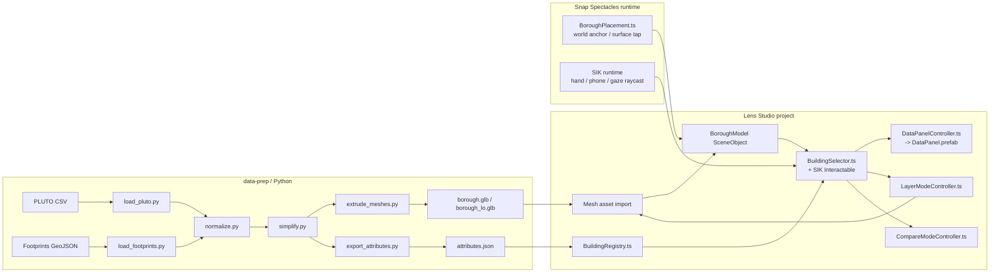

# Levitating City Twin — Snap Spectacles Build Plan

> **Pivot.** This project is no longer a React / Three.js web prototype. It is an **AR spatial digital twin for Snap Spectacles**, built in **Lens Studio** with the **Spectacles Interaction Kit (SIK)** as the interaction layer. The web codebase is being retired; only the data-prep mindset and the visual-design intent carry over.

---

## 1. Project mission

Build an interactive AR spatial digital twin of one NYC borough that:

- Appears as a **levitating 3D model** the user places in their physical space using Snap Spectacles.
- Lets the user walk around it like an architectural model on an invisible table.
- Lets the user **target, hover, and select buildings** with SIK pinch / gaze / phone-controller input.
- Surfaces a **floating AR data panel** for the selected building.
- **Switches between data layers** (footprint, infrastructure, risk, density, compare) by changing color / height / opacity.
- Supports a **compare mode** for two buildings or zones, side-by-side in AR.

One-line: *An AR spatial digital twin for Snap Spectacles that uses SIK to let users place, explore, select, and analyze a levitating 3D borough model through embodied interaction.*

---

## 2. Tech stack (locked)

- **Snap Spectacles** — target hardware. The deliverable is a Lens that runs on Spectacles, not a web app.
- **Lens Studio** — authoring environment for the Spectacles experience (scenes, materials, scripts, asset import, on-device preview).
- **Spectacles Interaction Kit (SIK)** — the interaction layer. Provides `Interactable`, `InteractableManipulation`, `InteractorTriggerEvent`, hand / phone controller raycasting, hover events, manipulation handles, and reusable AR UI primitives (buttons, sliders, panels).
- **TypeScript** — all script logic in Lens Studio (`Assets/Scripts/*.ts`). Used for selection, layer switching, panel updates, compare mode, animation tweaks.
- **Python 3.11 + GeoPandas + pandas + shapely** — pre-bake spatial data outside Lens Studio.
- **3D assets** — generated from data-prep (extruded GLB / OBJ per layer) plus authored Lens Studio prefabs (platform, panels, particles).
- **Source data** — NYC PLUTO (CSV) for attributes; NYC Building Footprints (GeoJSON) for geometry; optional safety / infrastructure / risk datasets per layer mode.

Explicitly removed: React, `@react-three/fiber`, `@react-three/drei`, `three`, `mapbox-gl`, `d3`, `react-scripts`, `gh-pages`. None are useful in Lens Studio.

---

## 3. Repo restructure

The repo becomes a monorepo of three workspaces. The old web prototype is moved into `archive/` so its visual-design and palette decisions remain readable, but no Lens Studio code depends on it.

### 3.1 Target layout

```
urban-dashboard/                       (rename to levitating-city-twin/ at convenience)
├── data-prep/                         Python pipeline
│   ├── requirements.txt
│   ├── src/
│   │   ├── load_pluto.py              read PLUTO CSV, filter to focus borough
│   │   ├── load_footprints.py         read footprints GeoJSON, match to PLUTO by lat/lng
│   │   ├── normalize.py               cos-lat projection, recenter to (0,0), scale to AR units
│   │   ├── simplify.py                Douglas-Peucker on polygons (target <300 vertices/building)
│   │   ├── extrude_meshes.py          shapely polygons + heights -> per-building OBJ/GLB
│   │   ├── export_attributes.py       JSON: { id, height, year, area, landuse, zoning, ... }
│   │   └── main.py                    one-shot pipeline: data -> lens/Assets/Data/
│   └── output/                        gitignored intermediate artifacts
├── lens/                              Lens Studio project
│   ├── Project.lsproj
│   └── Assets/
│       ├── Data/                      consumed from data-prep output
│       │   ├── borough.glb            merged borough mesh (LOD 0)
│       │   ├── borough_lo.glb         simplified mesh (LOD 1)
│       │   ├── attributes.json        per-building metadata, keyed by id
│       │   └── platform.glb           plinth / glow ring (authored separately)
│       ├── Materials/
│       │   ├── Building_Default.mat
│       │   ├── Building_Selected.mat  (emissive cyan)
│       │   ├── Building_Compare.mat   (emissive magenta)
│       │   ├── Platform_Glass.mat
│       │   └── Layer_Heat.mat         shader for per-instance color (height/risk/density)
│       ├── Prefabs/
│       │   ├── DataPanel.prefab       SIK-driven floating UI
│       │   ├── ComparePanel.prefab
│       │   ├── LayerToggle.prefab     row of mode buttons
│       │   └── BoroughLabel.prefab    floating 3D text
│       ├── Scripts/                   TypeScript
│       │   ├── BoroughPlacement.ts    spawn / anchor the model in AR
│       │   ├── BuildingRegistry.ts    load attributes.json, map mesh ids -> records
│       │   ├── BuildingSelector.ts    SIK Interactable wiring, hover/select state
│       │   ├── DataPanelController.ts populate panel from selected record
│       │   ├── LayerModeController.ts swap material/per-vertex color by layer mode
│       │   ├── CompareModeController.ts pin first, second-select, diff render
│       │   ├── BoroughAnimator.ts     levitation bob, glow pulse on select
│       │   └── types.ts               shared interfaces (BuildingRecord, LayerMode)
│       └── Textures/, Audio/, Fonts/  as needed
├── docs/
│   ├── spatial-twin-buildplan.md          (web-only plan, superseded)
│   └── spatial-twin-spectacles-plan.md    (this file)
├── archive/                                 frozen old web code; reference only
│   └── web-prototype/                       contents of current src/ + public/
└── README.md                                top-level summary + how-to-run pointers
```

### 3.2 Concrete delete / archive list (current repo)

Move into `archive/web-prototype/` (preserved, untouched by Lens Studio):

- entire `src/` folder
- entire `public/` folder
- `package.json`, `package-lock.json`, `node_modules/`, `build/`, `.env`

Delete outright (no longer relevant, not worth archiving):

- `node_modules/` after archiving (regenerable)
- `build/` (regenerable)
- `.env`'s `REACT_APP_MAPBOX_TOKEN` line

Keep at repo root:

- `.git/`
- `.gitignore` (extend to ignore `data-prep/output/`, `lens/Cache/`, `archive/web-prototype/node_modules/`)
- `README.md` (rewrite to point at the three workspaces)
- `docs/`

### 3.3 New tooling to install locally

- **Lens Studio** (latest, with Spectacles target enabled). Required for opening `lens/Project.lsproj`.
- **Snap Spectacles** paired and signed in via Lens Studio's device pairing flow (for on-device preview).
- **Spectacles Interaction Kit** asset package, imported into the Lens Studio project (`Asset Library -> Spectacles Interaction Kit -> Import`).
- **Python 3.11+**, with `requirements.txt`:
  ```
  geopandas>=0.14
  pandas>=2.1
  shapely>=2.0
  pyproj>=3.6
  trimesh>=4.0       # for OBJ/GLB export
  ```

---

## 4. End-to-end component map



### 4.1 When each piece comes into play

- **Phase 0**: monorepo restructure, tooling install.
- **Phase 1**: `data-prep/` end-to-end (Python).
- **Phase 2**: Lens Studio scene scaffolding, asset import, `BoroughPlacement.ts`.
- **Phase 3**: SIK + `BuildingSelector.ts`.
- **Phase 4**: `DataPanelController.ts` + `DataPanel.prefab`.
- **Phase 5**: `LayerModeController.ts` + `Layer_Heat.mat` + `LayerToggle.prefab`.
- **Phase 6**: `CompareModeController.ts` + `ComparePanel.prefab`.
- **Phase 7**: materials, animations, polish (`BoroughAnimator.ts`, glow shaders).

---

## 5. Phase plan

### Phase 0 — Repo restructure & tooling (~0.5 day)

What to do:

1. `mkdir archive/web-prototype data-prep data-prep/src data-prep/output lens`.
2. `git mv src archive/web-prototype/src`, same for `public/`, `package.json`, `package-lock.json`, `build/`, `.env`. Commit so the move is recorded with history.
3. Add `data-prep/requirements.txt` with the dependencies in §3.3.
4. Create empty `lens/` folder; in Lens Studio, `File -> New Project` saved into `lens/Project.lsproj`. Switch the project's target to **Spectacles**. Import the **Spectacles Interaction Kit** package.
5. Update `.gitignore`:
   ```
   data-prep/output/
   data-prep/.venv/
   lens/Cache/
   lens/Imports/
   archive/web-prototype/node_modules/
   archive/web-prototype/build/
   ```
6. Rewrite top-level `README.md` so it lists the three workspaces and how each is run.

Acceptance: `archive/`, `data-prep/`, `lens/` exist; Lens Studio opens `lens/Project.lsproj` and shows SIK in the Asset Browser.

### Phase 1 — Data prep pipeline (~1.5 days)

Deliverable: a single `python data-prep/src/main.py --borough MN` run that produces `lens/Assets/Data/borough.glb`, `borough_lo.glb`, and `attributes.json`.

Files to create in `data-prep/src/`:

1. **`load_pluto.py`** — read the PLUTO CSV (use the existing `pluto_3d_sample.csv` content from `archive/web-prototype/public/`), keep only `bbl, latitude, longitude, numfloors, yearbuilt, bldgarea, landuse, zonedist1, address, borough`. Filter to the focus borough.
2. **`load_footprints.py`** — fetch / load the NYC Building Footprints GeoJSON (`5zhs-2jue`). Spatial-join PLUTO to footprints by point-in-polygon (use `geopandas.sjoin`), with a 45 m nearest-neighbor fallback (mirrors the logic in `archive/web-prototype/src/utils/footprints.js`).
3. **`normalize.py`** — reproject footprints to a local cos-lat-corrected meter frame centered on the borough centroid; scale so the longest borough axis fits in **1.5 AR meters** (roughly the size of a coffee table; tune later).
4. **`simplify.py`** — Douglas-Peucker per polygon to a tolerance that keeps total vertex count under ~150k for the high-LOD mesh and ~30k for the low-LOD mesh.
5. **`extrude_meshes.py`** — for each polygon, extrude to `height = max(min_h, numfloors * 3.5m)`. Merge into one mesh per LOD using `trimesh`. Export `borough.glb` and `borough_lo.glb`. Each face carries a `building_id` attribute (custom mesh attribute) so Lens Studio can ray-pick a specific building from the merged mesh.
6. **`export_attributes.py`** — write `attributes.json`:
   ```json
   {
     "buildings": {
       "<bbl>": { "address": "...", "numfloors": 12, "yearbuilt": 1928,
                  "bldgarea": 24500, "landuse": "4", "zonedist1": "R8B",
                  "centroidLocal": [x, z], "heightLocal": h }
     },
     "borough": "MN", "centerLngLat": [...], "scaleMeters": 1.5
   }
   ```
7. **`main.py`** — chains the above into one CLI command, with `--borough`, `--out lens/Assets/Data/`, `--simplify-high 1.0`, `--simplify-low 3.5` flags.

Acceptance: running the pipeline on Manhattan produces three artifacts under 50 MB total, and a `trimesh` quick-view confirms recognizable Manhattan geometry.

### Phase 2 — Lens Studio scene foundation (~1 day)

In Lens Studio:

1. Create the scene root `BoroughTwin` with children:
   - `Platform` — a flat oval glass mesh + emissive ring particle effect (authored).
   - `BoroughModel` — empty SceneObject; populated at runtime from `borough.glb`.
   - `Lighting` — directional key + ambient + a soft cyan rim light.
   - `BoroughLabel` — `BoroughLabel.prefab` floating ~5 cm above the platform.
2. Author `Platform_Glass.mat` (translucent, Fresnel rim, subtle grid texture) and apply it.
3. Drop the imported `borough.glb` into `BoroughModel` and apply `Building_Default.mat`.
4. Write **`BoroughPlacement.ts`** — exposes a public method `placeAt(worldPos: vec3)`. Uses SIK's surface placement / phone-controller raycast to spawn the whole `BoroughTwin` at a tapped surface. Includes a placement preview state and a confirm tap.
5. Write **`BoroughAnimator.ts`** — gentle 5 mm bob and 0.5 deg yaw drift to sell the levitation. Optional, runs after placement.
6. Write **`BuildingRegistry.ts`** — on scene start, fetch `attributes.json` (via `Asset.RemoteServiceModule` or local asset binding), parse, hold a `Map<id, BuildingRecord>` for downstream scripts.

Acceptance: previewing on Spectacles, the borough model snaps onto a chosen surface, levitates, and reads as one merged glass-like structure.

### Phase 3 — Building selection via SIK (~1.5 days)

1. Add an SIK `Interactable` component to `BoroughModel`. Configure it for raycast-based selection.
2. Write **`BuildingSelector.ts`**:
   - On `onHoverEnter` / `onHoverExit` — read the hit triangle index, look up its `building_id` mesh attribute, look up the record in `BuildingRegistry`, emit a `hoveredId` signal. Apply `Building_Selected.mat`'s emissive color at low intensity to that building only via per-vertex color or a sub-mesh swap.
   - On `onTriggerStart` — promote the hovered id to `selectedId`. Emit a select signal, lift the building 8 cm via a per-instance offset (vertex shader uniform driven by id), and fire a glow pulse.
   - On click outside any building (raycast misses geometry), clear `selectedId`.
3. Visual feedback details:
   - Hover: emissive intensity 0.4, no lift.
   - Selected: emissive intensity 1.0, 8 cm lift, ring pulse on the ground.
4. Test with hand-tracking pinch, phone-controller, and gaze-trigger inputs; SIK abstracts these.

Acceptance: looking at any building outlines it; pinching selects it; the selection persists until cleared or another building is picked.

### Phase 4 — Floating AR data panel (~1 day)

1. Author `DataPanel.prefab`: a billboarded card (faces the user via SIK billboard component) with rows for Address, Land Use, Zoning, Floors, Year, Area. Use SIK's UI primitives for consistency.
2. Write **`DataPanelController.ts`**:
   - Subscribe to the `selectedId` signal from `BuildingSelector`.
   - Look up the record in `BuildingRegistry`.
   - Show / hide the panel; tween scale 0.0 -> 1.0 over 200 ms on show.
   - Anchor the panel ~30 cm above the building's local centroid (`record.centroidLocal + heightLocal + 0.3`).
3. Add a small "X" SIK button on the panel that calls `BuildingSelector.clearSelection()`.

Acceptance: selecting a building pops a panel above it, populated with metadata; deselecting closes it cleanly.

### Phase 5 — Data layer switching (~1.5 days)

1. Author `LayerToggle.prefab`: a horizontal row of SIK buttons (`Default`, `Height`, `Year`, `Land Use`, `Risk`). Anchored at the front edge of the platform.
2. Write **`LayerModeController.ts`**:
   - Holds `currentMode: LayerMode`.
   - On mode change, computes a per-building color and sets it on a custom material attribute (`buildingColor` array uniform indexed by `building_id`).
   - Color logic mirrors `archive/web-prototype/src/utils/building-color.js`:
     - `Height` and `Year` — sequential ramp from a percentile-clipped domain.
     - `Land Use` — categorical map.
     - `Risk` / `Density` — pulled from optional auxiliary CSVs prepared in Phase 1.
3. Update `Layer_Heat.mat` to read the per-building color via a UV-encoded lookup texture (1D texture sized by max id; written from TypeScript on mode change).
4. Hook the toggle buttons' `InteractableTriggerEvent` to `LayerModeController.setMode(mode)`.

Acceptance: switching modes recolors the entire borough instantly; selection / hover materials still take precedence.

### Phase 6 — Compare mode (~1 day)

1. Author `ComparePanel.prefab`: two-column AR card showing both records' metrics with delta values.
2. Write **`CompareModeController.ts`**:
   - State: `pinnedId`, `compareId`.
   - On the existing data panel, show a "Pin" SIK button. Pinning sets `pinnedId` and locks the panel in place.
   - The next building selection becomes `compareId` and triggers `ComparePanel` instead of `DataPanel`.
   - Pinned building gets an always-on cyan halo (`Building_Selected.mat`); compare building gets magenta (`Building_Compare.mat`).
   - "Unpin" or "Close" returns the system to single-select mode.

Acceptance: I can pin one tower, look at another, and see deltas in floors, year, area in AR.

### Phase 7 — Visual polish (~1-2 days)

- Glow pulse on selection (Lens Studio's particle / shader).
- Soft ground shadow under each building (precompute in Phase 1; export as a transparent quad texture).
- Floor-band stripes on the selected building's facade — a fragment-shader add to `Building_Selected.mat`.
- Borough label that fades in on placement.
- Audio: subtle hum during levitation; click on selection.
- Performance pass: confirm 60 fps on Spectacles with the high-LOD mesh; if not, tune `simplify.py` thresholds and re-run Phase 1.

---

## 6. First-week checklist

- Day 1: Phase 0 done; Lens Studio opens `lens/`; SIK imported.
- Days 2-3: Phase 1 pipeline produces a viable `borough.glb` for Manhattan.
- Day 4: Phase 2 — model placed and levitating in Spectacles preview.
- Day 5: Phase 3 — selection works, even if the panel is still placeholder.

Phases 4-7 are week-2+ work.

---

## 7. Deliberately out of scope

- Multi-borough overview (one borough is the prototype).
- Web parity (the React prototype is archived; not a parallel deliverable).
- Mobile / non-Spectacles AR fallbacks.
- Real-time data streams (datasets are pre-baked in Phase 1; refresh is a re-run of the pipeline).
- Cross-user / multiplayer placement.
- Persistence of selections across sessions.

---

## 8. Open questions to resolve before Phase 1

1. **Borough choice.** Manhattan has the densest geometry but the largest mesh budget; Staten Island fits trivially but is sparse. A reasonable starter is a **single Manhattan neighborhood** (e.g., Midtown, ~2 km square) so the model fits comfortably as a tabletop object. Confirm scope before writing `data-prep/src/load_pluto.py`'s borough filter.
2. **Layer datasets.** "Risk", "infrastructure", and "density" need a concrete data source. PLUTO alone won't give risk scores. Identify the CSV / GeoJSON for each non-PLUTO layer before Phase 5, otherwise drop those modes from the layer toggle.
3. **Input modality.** Spectacles supports hand-tracking pinch, phone controller, and gaze. SIK abstracts them, but the visual affordances differ — confirm which is the *primary* targeted modality for the demo so hover hints match.
