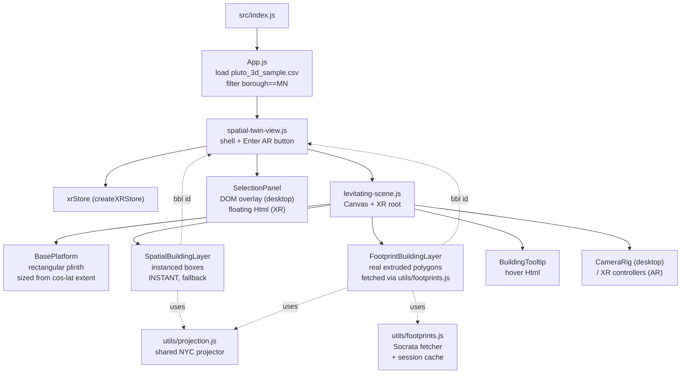

# Levitating City Twin — WebXR Build Plan (active)
> **Active plan.** Stack: Three.js + WebXR via React Three Fiber and `@react-three/xr`. Deploy as a webpage; Quest browser / Android Chrome users tap "Enter AR". The earlier Lens Studio plan ([spatial-twin-spectacles-plan.md](spatial-twin-spectacles-plan.md)) and the earlier web-only plan ([spatial-twin-buildplan.md](spatial-twin-buildplan.md)) are superseded.
---
## 1. Mission
Render **Manhattan** as a **levitating, rectangular, interactive 3D model** with **real NYC building footprints**, viewable on the desktop and enterable in WebXR. The buildings must look like buildings (real polygon shapes, real proportions), spread across a properly proportioned rectangular platform.
Single deliverable, three viewing modes:
- **Desktop** — orbit / zoom / click on a webpage.
- **WebXR (Quest browser, Android Chrome)** — "Enter AR" places the floating Manhattan model on a real surface, controllers / hands select buildings.
- **iOS** — viewable on desktop-style canvas (Safari WebXR is partial; AR session may be unavailable but the 3D scene still works).
---
## 2. Tech stack (locked)
Already installed, kept:
- `react@18`
- `@react-three/fiber@^8`
- `@react-three/drei@^9`
- `three@^0.184`
- `d3@7` (only for color helpers in `src/utils/building-color.js`)
- `react-scripts@5` (CRA build)
To add:
- **`@react-three/xr@^6`** — `XR`, `createXRStore`, `XROrigin`, controllers / hands raycasting, AR session button.

To remove:
- `mapbox-gl` — only used by the deleted `city-scene-mapbox.js`. Drop it from `package.json` and the `.env` token.
- `gh-pages` — optional. Keep only if you want `npm run deploy`.
---
## 3. What stays, what dies
### 3.1 Keep (becomes the whole system)
- [src/App.js](src/App.js) — trim.
- [src/components/layout/spatial-twin-view.js](src/components/layout/spatial-twin-view.js) — modify (add Enter AR button + scale toggle).
- [src/components/layout/spatial-twin.css](src/components/layout/spatial-twin.css) — modify.
- [src/components/three/levitating-scene.js](src/components/three/levitating-scene.js) — modify heavily (rectangular platform, projector, XR).
- [src/components/three/spatial-building-layer.js](src/components/three/spatial-building-layer.js) — modify (instant box renderer, used as fallback while footprints stream in).
- [src/components/three/footprint-building-layer.js](src/components/three/footprint-building-layer.js) — modify (use shared projector, merge geometries, support hover/click via instanceId or per-mesh raycast).
- [src/components/three/building-tooltip.js](src/components/three/building-tooltip.js) — reuse, restyle for dark theme.
- [src/components/three/selection-panel.js](src/components/three/selection-panel.js) — reuse, restyle, drop the "Apply as Filters" button.
- [src/components/three/camera-rig.js](src/components/three/camera-rig.js) — reuse later (Phase 5 / multi-scale).
- [src/components/three/legend-3d.js](src/components/three/legend-3d.js) — reuse later (Phase 6 / layer modes).
- [src/utils/projection.js](src/utils/projection.js) — used everywhere for cos-lat-corrected lng/lat → world XZ.
- [src/utils/footprints.js](src/utils/footprints.js) — Socrata `5zhs-2jue` fetcher.
- [src/utils/building-color.js](src/utils/building-color.js) — color helpers.
- [src/colors.js](src/colors.js) — palette tokens.
### 3.2 Delete (dashboard era; nothing in the spatial branch references them)
Files:


- `src/components/charts/` (entire folder).
- `src/components/layout/dashboard.js`, `topbar.js`, `filtersbar.js`, `city-view3d.js`.
- `src/components/three/city-scene-mapbox.js`, `city-scene3d.js`, `building-layer.js`, `footprint-mesh.js`, `ground-plane.js`, `active-filters-3d.js`, `borough-boundaries.js`, `borough-ground-tints.js`, `borough-labels3d.js`, `camera-presets.js`.
- `src/utils/borough-hulls.js`.
Public assets:
- `public/pluto_sample.csv`, `full_stats.csv`, `landuse_data.csv`, `trend_data.csv`, `zoning_data.csv`, `borough-geojson.json`.
Config:
- `mapbox-gl` from `package.json` + lockfile.
- `REACT_APP_MAPBOX_TOKEN` line in `.env`.
---
## 4. Component map (after cleanup)

How it loads:


1. App starts → CSV → filter to Manhattan → `SpatialTwinView` mounts.
2. Scene mounts with **boxes only** (instant; no network). Hover / click already works.
3. In the background, `fetchFootprintsForRecords(data)` streams real footprints in chunks.
4. As batches resolve, those records swap from box to extruded footprint. The rest stay on boxes (some PLUTO records have no matched footprint — that's the documented fallback).
5. User taps "Enter AR" → scene re-anchors as a tabletop-scale model in XR.
---
## 5. Phases
### Phase 0 — Cleanup (~20 min)
Mechanical: delete the files in §3.2, drop `mapbox-gl` and `REACT_APP_MAPBOX_TOKEN`, run `npm install` to refresh the lockfile, run `npm start` to confirm the app still boots from `App.js → SpatialTwinView → LevitatingCityScene`.
Acceptance: app boots, no broken imports.
### Phase 1 — Rectangular Manhattan platform


Files: [src/utils/projection.js](src/utils/projection.js), [src/components/three/levitating-scene.js](src/components/three/levitating-scene.js), [src/components/three/spatial-building-layer.js](src/components/three/spatial-building-layer.js).
1. Add `derivePlatformSize(extent, worldSize)` to `projection.js`:
   ```javascript
   export function derivePlatformSize(extent, worldSize) {
     const cosLat = Math.cos((extent.centerLat * Math.PI) / 180);
     const lngSpan = (extent.maxLng - extent.minLng) * cosLat;
     const latSpan = extent.maxLat - extent.minLat;
     const scale = worldSize / Math.max(lngSpan, latSpan);
     return { platformWidth: lngSpan * scale, platformDepth: latSpan * scale };
   }
   ```
2. In `LevitatingCityScene`, compute extent + projector + dims once via `useMemo` and pass them down. Replace the hard-coded `boxGeometry args={[14, 0.18, 14]}` and `gridHelper args={[14, 14, ...]}` with rectangular dims from the borough extent.
3. In `SpatialBuildingLayer`, replace the local `computeLocalBounds` + `normalizeToPlatform` with the shared projector. Drop `platformSize: 10.8`. Buildings now sit at their cos-lat-correct positions on a Manhattan-shaped plinth.
Acceptance: orbit Manhattan, see a tall narrow plinth (~5 wide × ~12 deep), no longitudinal stretch, no buildings hanging off the edge.
### Phase 2 — Proper buildings (real NYC footprints)
Files: [src/components/three/footprint-building-layer.js](src/components/three/footprint-building-layer.js), [src/components/three/levitating-scene.js](src/components/three/levitating-scene.js), [src/components/three/spatial-building-layer.js](src/components/three/spatial-building-layer.js).
1. Update `FootprintBuildingLayer`:
   - Accept `project` (the Phase 1 projector) and use it instead of `PROJECTOR_NYC`.
   - Use `mergeGeometries(geoms)` (`three/examples/jsm/utils/BufferGeometryUtils.js`) into one merged BufferGeometry; render as a single `<mesh>` to keep draw calls down.
   - On the merged geometry, store a `bblId` per face via a `Float32BufferAttribute` so raycast can map `intersection.faceIndex` back to a building.
   - Wire `onPointerMove` / `onClick` on the single mesh → translate `faceIndex` to a `bbl`.
2. In `LevitatingCityScene`:
   - Add state `footprintsById: Map<bbl, FootprintEntry>` and a loading flag.
   - On mount, call `fetchFootprintsForRecords(data, { onProgress })` from [src/utils/footprints.js](src/utils/footprints.js). Update state every batch (the fetcher already chunks ~15 records per request, ~6 in flight).
   - Render **both** layers simultaneously:
     - `SpatialBuildingLayer` rendering only records *not yet* matched (instant).
     - `FootprintBuildingLayer` rendering only records *matched* (real polygons).
   - As footprints arrive, the box-renderer set shrinks and the footprint-renderer set grows. Visually, boxes fade into real shapes.
3. Heights:
   - Per building height = `max(MIN_H, numfloors × HEIGHT_PER_FLOOR)`.
   - In world units, with platform `worldSize=12`, set `HEIGHT_PER_FLOOR ≈ 0.06` so a 50-floor tower reads tall but not absurd.
4. Lightweight realism touches (cheap, big payoff):
   - Slight vertex-color darkening at the base, lightening at the roof — gives extruded boxes free shading.
   - Roughness 0.6, metalness 0.15. Borough-tinted color (Manhattan rose from `colors.js`) modulated by a per-building hash so rooftops don't form a flat color sheet.
Acceptance: open the page, see Manhattan grow from boxes into recognizable footprint extrusions over a few seconds, with the silhouette reading correctly (Midtown + Lower Manhattan high-rises, brownstones on side streets short).
### Phase 3 — Selection polish
Files: [src/components/three/spatial-building-layer.js](src/components/three/spatial-building-layer.js), [src/components/three/footprint-building-layer.js](src/components/three/footprint-building-layer.js), [src/components/three/building-tooltip.js](src/components/three/building-tooltip.js), [src/components/three/selection-panel.js](src/components/three/selection-panel.js), [src/components/layout/spatial-twin-view.js](src/components/layout/spatial-twin-view.js).
1. Both layers report hover via `(bbl, worldPos)` and click via `(bbl, record)` — same callback contract regardless of which renderer the building is on.
2. `BuildingTooltip` floats above the hovered building.
3. Selected building gets:
   - On the box layer: instance color override (already implemented).
   - On the footprint layer: a sibling `<mesh>` of just that building's geometry with an emissive cyan material.
   - A flat translucent ring on the platform at its base.
4. Restyle `SelectionPanel` for dark glass; replace the inline card in `SpatialTwinView`.
5. `onPointerMissed` on `<Canvas>` clears the selection.
Acceptance: hover any building → tooltip; click → outline + halo + side panel; click empty platform → clear.

### Phase 4 — WebXR enable
Files: [src/components/layout/spatial-twin-view.js](src/components/layout/spatial-twin-view.js), [src/components/three/levitating-scene.js](src/components/three/levitating-scene.js).
1. `npm install @react-three/xr`.
2. In `SpatialTwinView`, create a single XR store at module scope:
   ```javascript
   import { createXRStore } from '@react-three/xr';
   const xrStore = createXRStore({
     hand: true,
     controller: true,
     emulate: false,
   });
   ```
   Render an "Enter AR" button: `<button onClick={() => xrStore.enterAR()}>Enter AR</button>`.
3. In `LevitatingCityScene`, wrap the scene tree in `<XR store={xrStore}>`. Use `<XROrigin>` to anchor the model so that in AR the platform sits ~1 m in front of the user at table height.
4. Conditional scaling: the desktop scene uses `worldSize=12` units (visually a coffee-table model). In AR, scale the whole `BoroughTwin` group to ~0.6 m on its longest axis (real-world tabletop). Use `useXR().session` to detect AR mode and switch a uniform scale.
5. In AR mode, hide DOM overlays (`SelectionPanel`, instructions) and render their replacements as `<Html transform>` panels parented to the world. The selected-building panel becomes a billboarded XR card.
6. Drop `OrbitControls` when in AR (controllers / head pose drive the camera). Re-enable on session end.

Acceptance: on a Quest, open the URL, tap Enter AR, see Manhattan floating in the room. Walk around it. Resume with desktop orbit on session end.
### Phase 5 — AR-native interactions
Files: [src/components/three/levitating-scene.js](src/components/three/levitating-scene.js), small new helper.
1. Use `@react-three/xr`'s controller / hand raycasting to drive the same hover / select pipeline used on desktop.
2. Pinch (hands) or trigger (controller) → fires the existing `onSelect(bbl, record)`.
3. Add a thumbstick / two-hand pinch gesture to scale the model: 0.3 m → 1.5 m on its long axis. This is the AR equivalent of "city / borough / building" zoom.
4. Optional: surface placement reticle (raycast to detected planes; tap to place model on table) instead of fixed XROrigin offset.
Acceptance: in AR, gaze + pinch on any tower → tooltip and panel float in space; pinch-zoom rescales the entire model under your hand.
---
## 6. First commit checklist (Phase 0 + 1 + 2)
This is the "Manhattan, proper buildings, rectangular surface, done now" deliverable.
- [ ] Delete dashboard files listed in §3.2.
- [ ] Remove `mapbox-gl` from `package.json`; `npm install`.
- [ ] Trim `src/App.js` (drop dead imports, drop the borough-set `console.log`).
- [ ] Add `derivePlatformSize` to `projection.js`.
- [ ] Make `LevitatingCityScene` compute extent + projector + platform dims; pass to children.
- [ ] Make `BasePlatform` and `gridHelper` accept rectangular dims.
- [ ] Rewire `SpatialBuildingLayer` to use the shared projector; drop `platformSize`.
- [ ] Add merged-geometry rendering + `bblId` face attribute + raycast handling to `FootprintBuildingLayer`.
- [ ] Have `LevitatingCityScene` kick off `fetchFootprintsForRecords` on mount and split records between box / footprint renderers.
- [ ] Verify: `npm start`, see a rectangular Manhattan that grows from boxes into real footprints over a few seconds.
WebXR (Phase 4) and AR interactions (Phase 5) follow once the desktop view looks right.
---
## 7. Out of scope (still)
- Multiple boroughs / NYC overview.
- Charts / dashboards / cross-filtering.
- Mobile-only (non-AR) phone layout.
- Persistence of selections.
- Mapbox / 2D map.